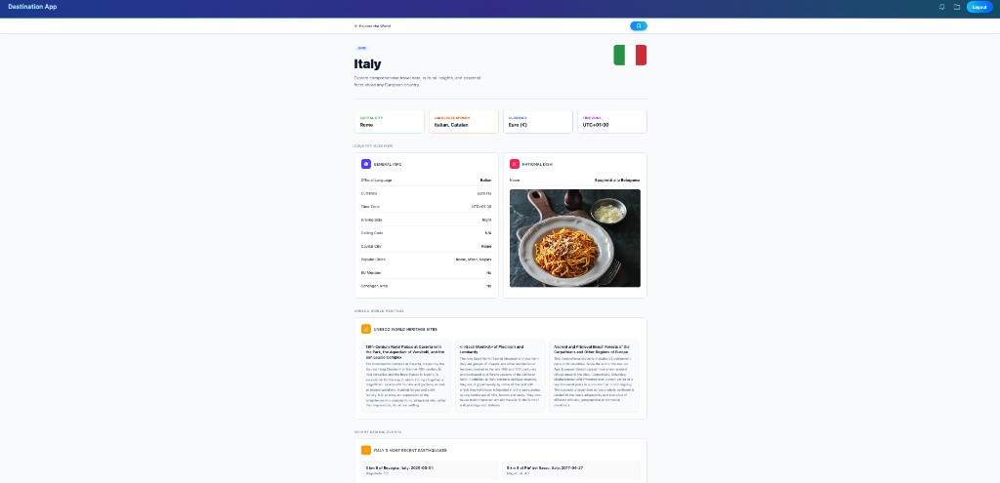

# ct-destination-app

A microservices platform designed for travelers and researchers to compile comprehensive information about various destinations in Europe, including country details, earthquake data, UNESCO World Heritage Sites, and weather summaries.

## Website



The React frontend aggregates country facts, UNESCO sites, earthquakes, and related data from the backend microservices.

## Services

The application consists of four Lambda microservices:

### Country Service
Retrieves comprehensive country information from REST Countries API and local database.
- Endpoint: `GET /country`
- Parameters: `countryName`
- Returns: Country details, city populations, national dish details

[Read more](./country/README.md)

### Earthquakes Service
Retrieves earthquake data by country name from USGS API.
- Endpoint: `GET /earthquakes`
- Parameters: `countryName`, `startTime`, `endTime`, `maxRadiusKm`, `minMagnitude`, `limit`
- Returns: Earthquake history with magnitude, location, and tsunami data

[Read more](./earthquakes/README.md)

### Tourism Service
Retrieves UNESCO World Heritage Sites information by country.
- Endpoint: `GET /tourism`
- Parameters: `countryName`
- Returns: UNESCO sites with descriptions

[Read more](./tourism/README.md)

### Weather Service
Retrieves monthly weather summaries by country.
- Endpoint: `GET /weather`
- Parameters: `countryName`, `month`
- Returns: Average min/max temperatures for the specified month

[Read more](./weather/README.md)

## Architecture

Each service follows Clean Architecture principles with four layers:
- **API Layer**: Lambda handlers
- **Application Layer**: Use cases and validation
- **Domain Layer**: Business entities
- **Infrastructure Layer**: External API integrations and database repositories

## Prerequisites

- NVM (Node Version Manager) - to manage Node.js versions
- Docker Desktop
- BiomeJS - for code formatting and linting

## Setup

Install the required Node.js version using NVM:

```bash
nvm install
nvm use
```

Install project dependencies:

```bash
npm install
```

Start Docker services (Postgres + DynamoDB Local):

```bash
docker compose up
```

Seed local databases from committed CSV files (required for shared baseline data):

```bash
cd data-scrape
cp .env.example .env.local
npm install
./run.sh seed
```

- `./run.sh seed` loads city populations, national dishes, UNESCO sites (Postgres), and weather (DynamoDB) from `data-scrape/src/data/`.
- `./run.sh all` also loads country information from the REST Countries API (set `REST_COUNTRIES_AUTHORIZATION` in `data-scrape/.env.local`).

See [data-scrape/README.md](./data-scrape/README.md) for details. Do not commit `.env.local` or runtime DB files under `docker/dynamodb/`.

Start the backend:

```bash
cd local-server
npm run dev
```

Run the frontend:

```bash
cd frontend
npm run dev
```

## Linting and Formatting

Lint and format the code:

```bash
npm run lint:fix
```
